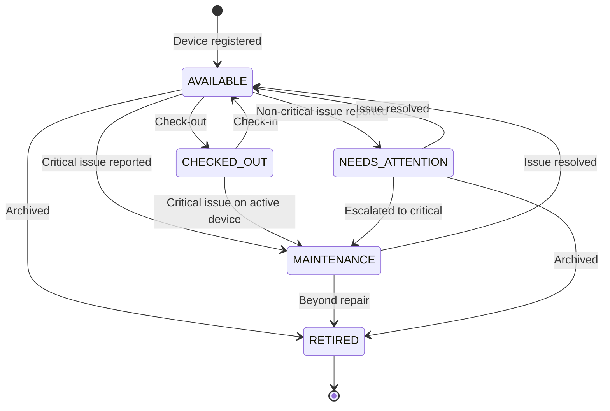
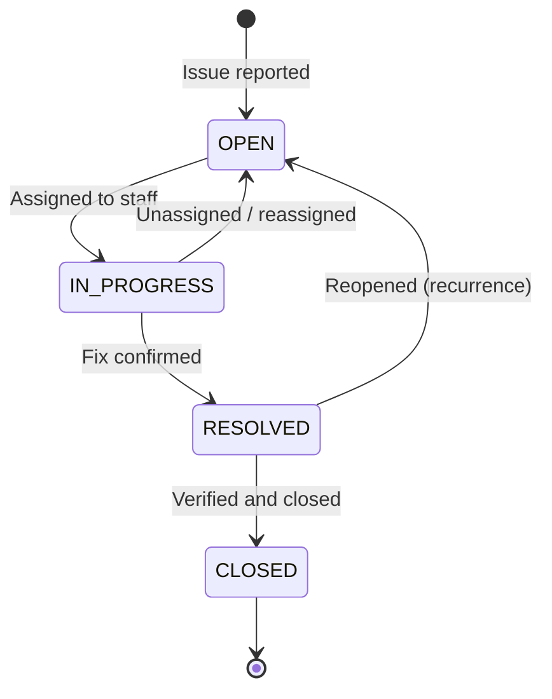
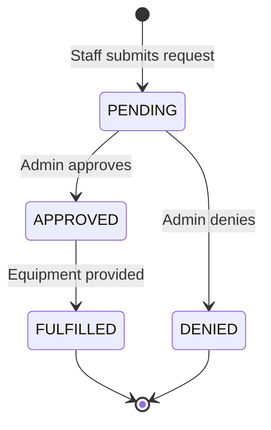

# Lappi — Feature List

| Field | Detail |
|-------|--------|
| **Document** | Feature List |
| **Product** | Lappi |
| **Version** | 1.0 |
| **Last Updated** | 2026-04-13 |
| **Status** | Approved |
| **Owner** | Christex Foundation |

---

## 1. Reading Guide

- **Priority**: Must (M) = required for launch, Should (S) = important but not blocking, Could (C) = nice to have
- **Phase**: 1 = Foundation, 2 = Operations, 3 = Insights
- **Status**: Planned / In Progress / Done — updated during development
- Feature IDs match the [PRD](./prd.md) requirement IDs where applicable

---

## 2. Feature Summary Matrix

| ID | Module | Feature | Priority | Phase | Status |
|----|--------|---------|----------|-------|--------|
| F-ASSET-01 | Asset Registry | Register new device | M | 1 | Planned |
| F-ASSET-02 | Asset Registry | Edit device details | M | 1 | Planned |
| F-ASSET-03 | Asset Registry | Retire/archive device | M | 1 | Planned |
| F-ASSET-04 | Asset Registry | Asset list with filters | M | 1 | Planned |
| F-ASSET-05 | Asset Registry | Asset detail page | M | 1 | Planned |
| F-ASSET-06 | Asset Registry | Asset status lifecycle | M | 1 | Planned |
| F-ASSET-07 | Asset Registry | Search by name/serial | M | 1 | Planned |
| F-ASSET-08 | Asset Registry | Device photo upload | S | 2 | Planned |
| F-ASSET-09 | Asset Registry | QR code label generation | C | 3 | Planned |
| F-SESSION-01 | Check-out/in | Quick check-out | M | 1 | Planned |
| F-SESSION-02 | Check-out/in | Check-in with condition note | M | 1 | Planned |
| F-SESSION-03 | Check-out/in | Active sessions view | M | 1 | Planned |
| F-SESSION-04 | Check-out/in | Session history (filterable) | M | 1 | Planned |
| F-SESSION-05 | Check-out/in | Purpose tagging (6 types) | M | 1 | Planned |
| F-SESSION-06 | Check-out/in | Overdue session alerts | S | 2 | Planned |
| F-SESSION-07 | Check-out/in | Batch check-out | C | 2 | Planned |
| F-PEOPLE-01 | Community Registry | Register new person | M | 1 | Planned |
| F-PEOPLE-02 | Community Registry | Edit person details | M | 1 | Planned |
| F-PEOPLE-03 | Community Registry | Person detail with history | M | 1 | Planned |
| F-PEOPLE-04 | Community Registry | People directory with search | M | 1 | Planned |
| F-PEOPLE-05 | Community Registry | Deactivate person | S | 1 | Planned |
| F-PEOPLE-06 | Community Registry | Usage metrics per person | M | 1 | Planned |
| F-ISSUE-01 | Issue Tracking | Report issue against asset | M | 1 | Planned |
| F-ISSUE-02 | Issue Tracking | Severity levels (4 tiers) | M | 1 | Planned |
| F-ISSUE-03 | Issue Tracking | Issue status flow | M | 1 | Planned |
| F-ISSUE-04 | Issue Tracking | Assign issue to staff | M | 1 | Planned |
| F-ISSUE-05 | Issue Tracking | Issue list with filters | M | 1 | Planned |
| F-ISSUE-06 | Issue Tracking | Resolution notes | M | 1 | Planned |
| F-ISSUE-07 | Issue Tracking | Auto-maintenance on critical | S | 1 | Planned |
| F-ISSUE-08 | Issue Tracking | Issue timeline | S | 2 | Planned |
| F-ISSUE-09 | Issue Tracking | Repair cost logging | C | 3 | Planned |
| F-ISSUE-10 | Issue Tracking | Reopen resolved issue | S | 2 | Planned |
| F-REQUEST-01 | Tech Requests | Submit request | M | 2 | Planned |
| F-REQUEST-02 | Tech Requests | Approve/deny with note | M | 2 | Planned |
| F-REQUEST-03 | Tech Requests | Mark as fulfilled | M | 2 | Planned |
| F-REQUEST-04 | Tech Requests | My requests view | M | 2 | Planned |
| F-REQUEST-05 | Tech Requests | All requests view (admin) | M | 2 | Planned |
| F-ANALYTICS-01 | Analytics | Sessions by purpose chart | S | 2 | Planned |
| F-ANALYTICS-02 | Analytics | Asset utilisation rate | S | 3 | Planned |
| F-ANALYTICS-03 | Analytics | Unique members served | M | 2 | Planned |
| F-ANALYTICS-04 | Analytics | Most-used assets ranking | S | 2 | Planned |
| F-ANALYTICS-05 | Analytics | Peak usage patterns | C | 3 | Planned |
| F-ANALYTICS-06 | Analytics | CSV export | M | 2 | Planned |
| F-DASH-01 | Dashboard | KPI stat cards (4) | M | 1 | Planned |
| F-DASH-02 | Dashboard | Recent activity feed | M | 1 | Planned |
| F-DASH-03 | Dashboard | Quick action buttons | M | 1 | Planned |
| F-DASH-04 | Dashboard | Assets needing attention | S | 1 | Planned |
| F-LOG-01 | Activity Log | Automatic event logging | M | 1 | Planned |
| F-LOG-02 | Activity Log | Filterable log view | M | 1 | Planned |
| F-LOG-03 | Activity Log | Field change diffs | S | 2 | Planned |
| F-AUTH-01 | Auth | Email/password login | M | 1 | Planned |
| F-AUTH-02 | Auth | Route protection | M | 1 | Planned |
| F-AUTH-03 | Auth | Role-based access | M | 1 | Planned |
| F-AUTH-04 | Auth | Staff account management | M | 1 | Planned |
| F-AUTH-05 | Auth | Session expiry (24h) | M | 1 | Planned |

---

## 3. Module Details

### 3.1 Asset Registry

The foundation layer. Every other module depends on assets existing in the system.

**Core fields per asset:**
- Name (required) — human-readable label, e.g. "Dell Latitude #3"
- Type (required) — one of: Laptop, Desktop, Tablet, Projector, Router, Phone, Camera, Printer, Networking, Other
- Serial Number (optional, unique) — manufacturer serial
- Status (system-managed) — AVAILABLE, CHECKED_OUT, MAINTENANCE, NEEDS_ATTENTION, RETIRED
- Condition (required) — Excellent, Good, Fair, Poor
- Location (optional) — where the device is physically stored
- Purchase Date (optional)
- Notes (optional) — free text
- Image URL (optional, Phase 2)

**Asset Lifecycle State Diagram:**

**Rules:**
- A device can only be checked out if its status is AVAILABLE
- A device can only be retired from AVAILABLE, MAINTENANCE, or NEEDS_ATTENTION
- CHECKED_OUT devices cannot be retired directly (must be checked in first)
- Status transitions are logged in the activity log

### 3.2 Check-Out / Check-In

The core daily workflow. This is what staff use multiple times per day.

**Check-out flow:**
1. Staff taps "New Check-Out" (quick action on dashboard or sessions page)
2. Search or select a person (search by name or phone)
3. Search or select an available asset (filtered to AVAILABLE only)
4. Select purpose from dropdown (Workshop, Cohort, Personal Learning, Research, Community Use, Staff Work)
5. Optional: add notes
6. Confirm — session created, asset status changes to CHECKED_OUT

**Check-in flow:**
1. Staff opens active sessions list
2. Finds the session (search by person or asset name)
3. Taps "Check In"
4. Optional: add condition note on return
5. Confirm — session closed, asset status changes to AVAILABLE

**Session purpose types and their meaning:**

| Purpose | Used When |
|---------|-----------|
| Workshop | One-off community workshop or event |
| Cohort | Part of a structured multi-week programme (e.g., 12-week Solana cohort) |
| Personal Learning | Individual borrowing a device for self-study |
| Research | Individual using a device for research purposes |
| Community Use | General community member usage (co-working, internet access, etc.) |
| Staff Work | Foundation staff using a device for internal work |

### 3.3 Community Registry (People)

A directory of everyone who interacts with Christex Foundation's devices.

**Key design decision**: Members do not create accounts. Staff register them with name and phone number during their first check-out. This eliminates onboarding friction and works for walk-in users.

**Person metrics (auto-calculated):**
- Total sessions count
- Last active date
- Most frequent purpose
- Favourite device (most sessions with)

### 3.4 Issue and Repair Tracking

A lightweight issue tracker focused on hardware problems.

**Issue Lifecycle State Diagram:**

**Severity definitions:**

| Severity | Colour | Meaning | Example |
|----------|--------|---------|---------|
| Critical | Red | Device is unusable. Immediate attention. | "Screen is completely black, won't turn on" |
| High | Orange | Major functionality impaired. | "Keyboard not working, can't type" |
| Medium | Amber | Partial functionality issue. Device usable. | "Battery dies after 1 hour" |
| Low | Blue | Minor cosmetic or non-blocking issue. | "Trackpad sometimes sticks" |

### 3.5 Tech Requests

Staff formally request equipment they need. Admin reviews and approves.

**Request Lifecycle State Diagram:**

### 3.6 Usage Analytics (Phase 2-3)

Transforms raw session data into insights for leadership and donor reporting.

**Key charts and views:**
- Sessions by purpose (bar chart, filterable by time period)
- Unique community members served (line chart over time)
- Most-used assets (ranked list with session count)
- Asset utilisation rate (% of available time in use, per asset)
- Peak usage patterns (heatmap by day/hour)
- All views exportable to CSV

### 3.7 Dashboard

The landing page after login. Provides at-a-glance operational awareness.

**KPI cards (always visible):**

| Card | Data | Links To |
|------|------|----------|
| Total Assets | Count by status (e.g., "47 total: 32 available, 10 checked out, 3 maintenance, 2 retired") | /assets |
| Active Sessions | Count of currently checked-out devices | /sessions |
| Open Issues | Count by severity (e.g., "8 open: 1 critical, 2 high, 3 medium, 2 low") | /issues |
| People Registered | Total count with breakdown (e.g., "124 total: 3 admin, 8 staff, 113 members") | /people |

### 3.8 Activity Log

An append-only audit trail of all system events.

**Logged actions:**
- ASSET_CREATED, ASSET_UPDATED, ASSET_RETIRED
- SESSION_STARTED, SESSION_ENDED
- ISSUE_REPORTED, ISSUE_ASSIGNED, ISSUE_STATUS_CHANGED, ISSUE_RESOLVED, ISSUE_CLOSED
- PERSON_CREATED, PERSON_UPDATED, PERSON_DEACTIVATED
- REQUEST_SUBMITTED, REQUEST_APPROVED, REQUEST_DENIED, REQUEST_FULFILLED
- USER_LOGIN, USER_LOGOUT

---

## 4. Phase Roadmap

### Phase 1 — Foundation
**Goal**: A working system that replaces manual tracking on day one.

Features included:
- Auth (login, route protection, role-based access)
- Asset Registry (full CRUD, lifecycle management)
- Community Registry (people directory with CRUD)
- Check-Out / Check-In (core workflow)
- Basic Issue Tracking (report, assign, resolve)
- Dashboard (KPI cards, activity feed, quick actions)
- Activity Log (automatic event logging)

**Milestone**: Staff can log in, register devices, check them in/out to community members, report issues, and see everything on a dashboard.

### Phase 2 — Operations
**Goal**: Complete operational workflows and initial data insights.

Features added:
- Tech Requests (submit, approve/deny, fulfil)
- Session analytics (by purpose, unique members, most-used assets)
- Overdue session alerts
- Batch check-out
- Issue timeline and reopen capability
- Device photo upload
- CSV data export
- Field change diffs in activity log

**Milestone**: Full operational workflow digitalised. Staff manage issues end-to-end, request equipment, and export data for reporting.

### Phase 3 — Insights
**Goal**: Turn data into intelligence for leadership and donors.

Features added:
- Asset utilisation rates
- Peak usage patterns
- Asset health scores (calculated from issue frequency, age, condition)
- Repair cost tracking and cost-per-asset reports
- QR code label generation
- PWA offline mode (service worker, offline queue that syncs)
- Predefined report templates for donor meetings

**Milestone**: Lappi generates actionable intelligence. Leadership can walk into a UNDP meeting with auto-generated usage reports.

---

## Related Documents

- [PRD](./prd.md) — Detailed requirements with acceptance criteria (FR-IDs map to F-IDs here)
- [User Flows](./user-flow.md) — Step-by-step workflows for each feature
- [Engineering Architecture](./engineering-architecture.md) — Technical implementation details
- [Implementation Plan](./implementation-plan.md) — Build sequence and task ordering
- [Completion Checklist](./completion-checklist.md) — Definition of done per feature and phase
