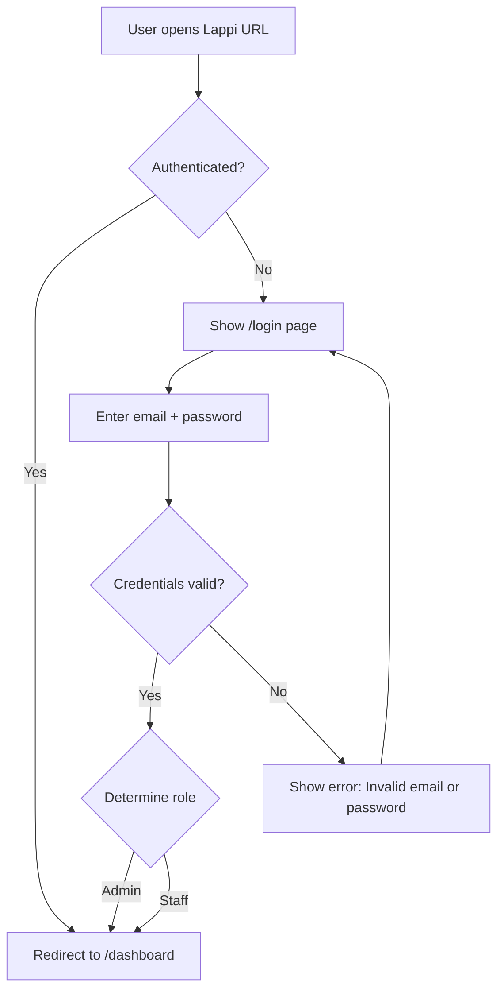
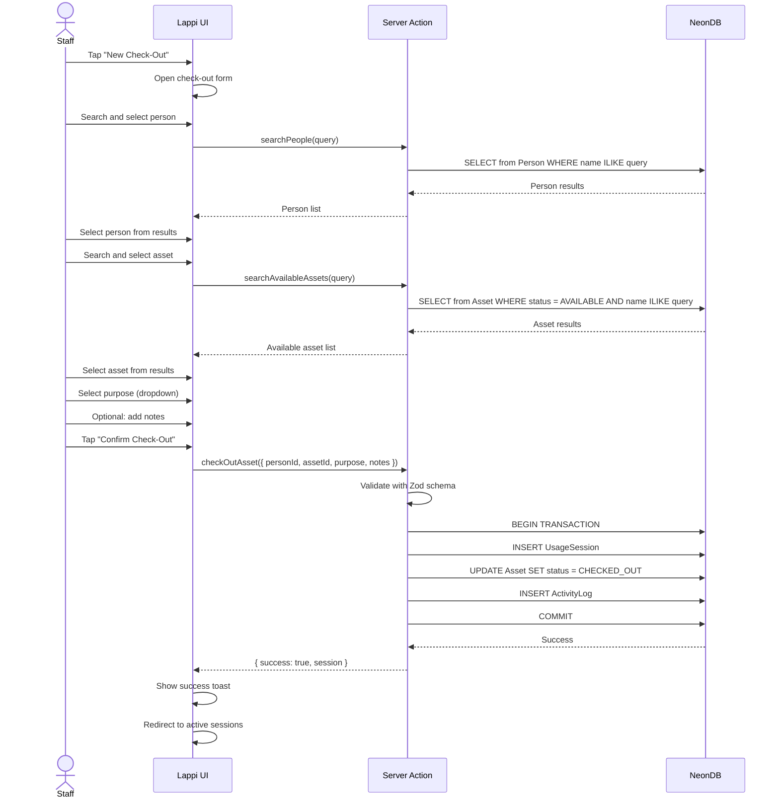
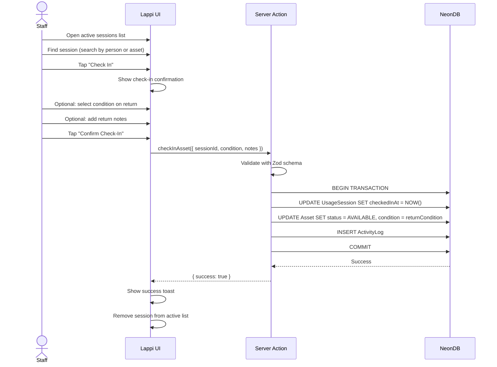
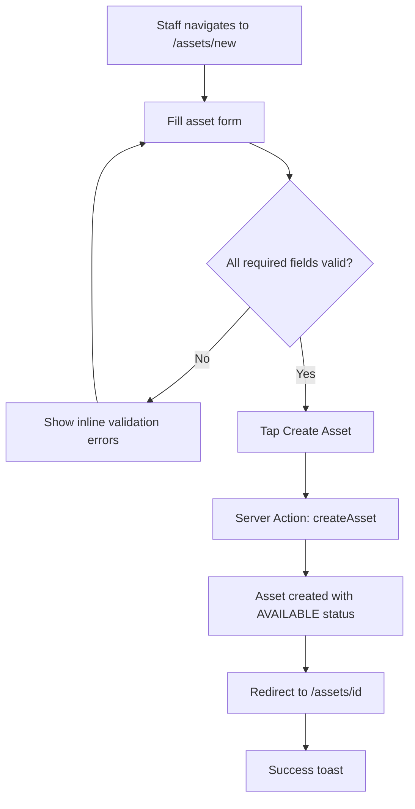
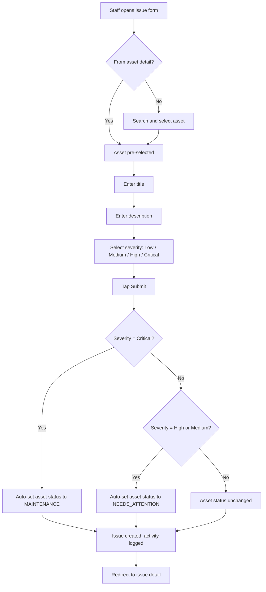
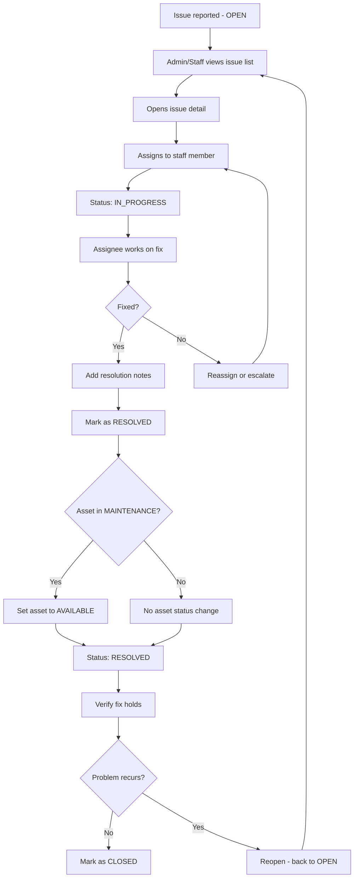
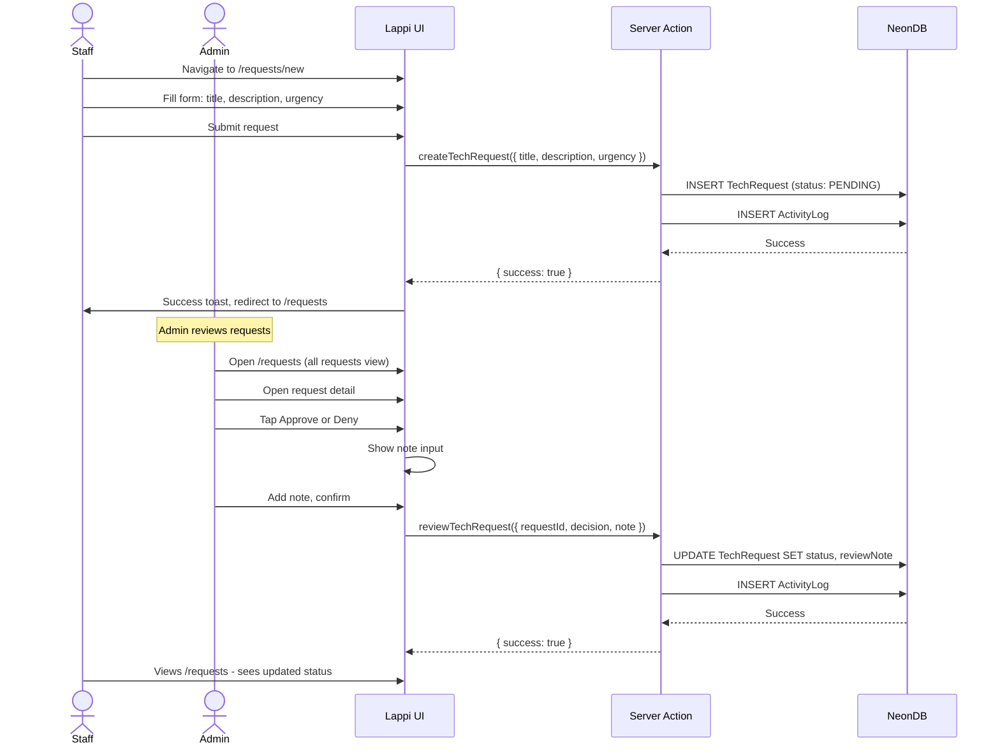
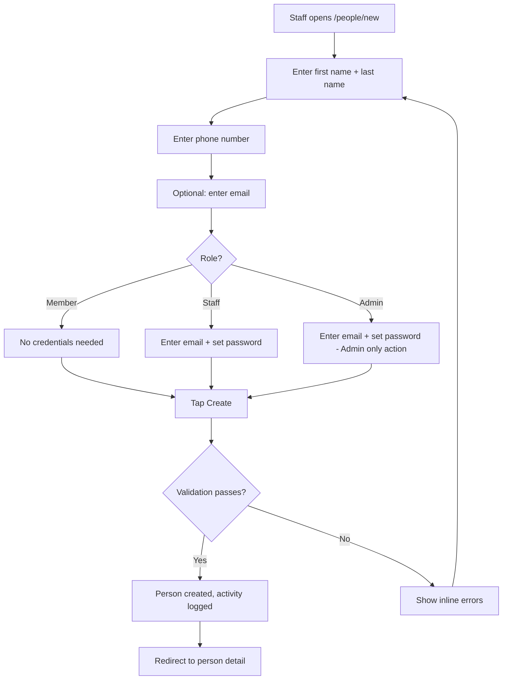
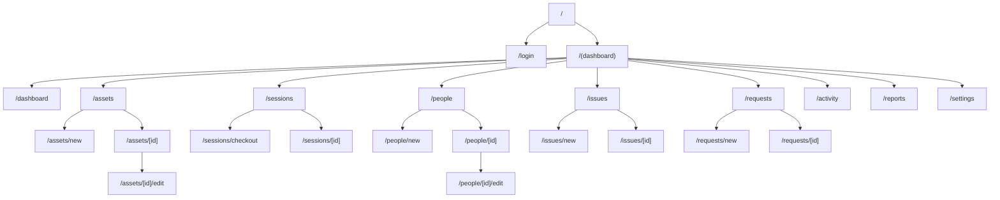

# Lappi — User Flows and Journeys

| Field | Detail |
|-------|--------|
| **Document** | User Flows |
| **Product** | Lappi |
| **Version** | 1.0 |
| **Last Updated** | 2026-04-13 |
| **Status** | Approved |
| **Owner** | Christex Foundation |

---

## 1. Overview

This document maps every key workflow in Lappi from the user's perspective. Each flow specifies preconditions, step-by-step actions, system responses, error paths, and post-conditions. Mermaid diagrams provide visual representations.

For feature specifications, see the [Feature List](./feature-list.md). For technical implementation, see the [Engineering Architecture](./engineering-architecture.md).

---

## 2. Authentication Flows

### 2.1 Staff/Admin Login

**Preconditions**: User has an email and password created by an admin.



**Steps:**
1. User navigates to Lappi URL
2. Middleware checks for valid session token
3. If authenticated, redirect to `/dashboard`
4. If not, display `/login` page
5. User enters email and password
6. System validates credentials against hashed password in database
7. On success: create JWT session, store role in token, redirect to `/dashboard`
8. On failure: display inline error, clear password field

**Error paths:**
- Invalid credentials: "Invalid email or password" (do not reveal which field is wrong)
- Account deactivated: "This account has been deactivated. Contact an admin."

### 2.2 Session Management

- Sessions use JWT tokens stored in HTTP-only cookies
- Token expires after 24 hours of inactivity
- On expiry, user is redirected to `/login` with a flash message
- Logout destroys the session token and redirects to `/login`

---

## 3. Core Workflow Flows

### 3.1 Asset Check-Out (Primary Flow)

This is the most important workflow in Lappi. It must be completable in under 30 seconds.

**Preconditions**: Staff is logged in. At least one asset is in AVAILABLE status. At least one person exists in the system.



**Steps:**
1. Staff taps "New Check-Out" (from dashboard quick action or sessions page)
2. **Select person**: Type name or phone to search. Select from results. If person doesn't exist, link to "Add Person" form.
3. **Select asset**: Type name or serial to search. Only AVAILABLE assets shown. Select from results.
4. **Select purpose**: Choose from dropdown: Workshop, Cohort, Personal Learning, Research, Community Use, Staff Work.
5. **Add notes** (optional): Free text for context.
6. **Confirm**: Tap "Confirm Check-Out" button.
7. System creates UsageSession, updates asset status to CHECKED_OUT, logs activity.
8. Success toast. Redirect to active sessions list.

**Error paths:**
- Asset no longer available (checked out by another staff between search and confirm): "This asset is no longer available. It was checked out by [staff name] at [time]."
- Person not found: Show "Add Person" link inline.
- Network failure: Show error toast with retry option.

**Post-conditions:**
- UsageSession record created with `checkedInAt = null`
- Asset status = CHECKED_OUT
- ActivityLog entry: SESSION_STARTED

### 3.2 Asset Check-In

**Preconditions**: An active session exists for the target asset.



**Steps:**
1. Staff opens active sessions (from dashboard or `/sessions`)
2. Finds the session by searching or scrolling
3. Taps "Check In" on the session row
4. Optional: select device condition on return (Excellent, Good, Fair, Poor)
5. Optional: add notes about the return
6. Confirm check-in
7. System closes session, updates asset status to AVAILABLE, logs activity

**Branch — Check-in with issue:**
If the device is returned damaged, staff can:
1. Complete check-in normally
2. Then tap "Report Issue" from the asset detail page (linked from the success confirmation)

### 3.3 Register New Asset



**Required fields**: Name, Type, Condition
**Optional fields**: Serial Number, Location, Purchase Date, Notes

### 3.4 Report an Issue



**Entry points:**
1. From asset detail page: "Report Issue" button (asset pre-selected)
2. From issues list: "New Issue" button (must select asset)
3. From dashboard: "Report Issue" quick action (must select asset)

### 3.5 Issue Resolution Pipeline



**Who can do what:**

| Action | Admin | Staff |
|--------|-------|-------|
| Report issue | Yes | Yes |
| Assign to staff | Yes | Yes |
| Change status | Yes | Yes (own assigned only) |
| Add resolution notes | Yes | Yes (own assigned only) |
| Close issue | Yes | No |
| Reopen issue | Yes | Yes |

### 3.6 Tech Request Submission and Approval

**Requester flow (Staff):**



### 3.7 Register a New Person



**Quick registration during check-out:**
If a person doesn't exist during the check-out flow, staff can add them inline with just first name, last name, and phone number (minimal fields), then continue the check-out without leaving the flow.

### 3.8 Dashboard Interaction

```mermaid
flowchart TD
    A[Staff logs in] --> B[/dashboard loads]
    B --> C[KPI Cards]
    B --> D[Quick Actions]
    B --> E[Recent Activity Feed]
    B --> F[Assets Needing Attention]

    C --> C1[Tap Total Assets card]
    C1 --> C2[Navigate to /assets]
    C --> C3[Tap Active Sessions card]
    C3 --> C4[Navigate to /sessions]
    C --> C5[Tap Open Issues card]
    C5 --> C6[Navigate to /issues]
    C --> C7[Tap People card]
    C7 --> C8[Navigate to /people]

    D --> D1[Tap New Check-Out]
    D1 --> D2[Navigate to /sessions/checkout]
    D --> D3[Tap Report Issue]
    D3 --> D4[Navigate to /issues/new]
    D --> D5[Tap Add Asset]
    D5 --> D6[Navigate to /assets/new]

    E --> E1[Tap activity entry]
    E1 --> E2[Navigate to related entity]

    F --> F1[Tap asset needing attention]
    F1 --> F2[Navigate to /assets/id]
```

---

## 4. Navigation Architecture

### 4.1 Site Map



### 4.2 Navigation Model

**Desktop (screen width >= 1024px):**
- Left sidebar, always visible, collapsible to icon-only mode
- Sidebar items: Dashboard, Assets, Sessions, People, Issues, Requests, Activity, Reports, Settings
- Active item highlighted
- User profile + logout at bottom of sidebar

**Tablet (768px - 1023px):**
- Sidebar collapsed to icon-only mode by default
- Expandable on tap
- Same items as desktop

**Mobile (< 768px):**
- Bottom tab bar with 5 primary items: Dashboard, Assets, Sessions, People, More
- "More" opens a sheet with: Issues, Requests, Activity, Reports, Settings
- No sidebar on mobile

### 4.3 Page Inventory

| Page | URL | Accessible By | Primary Action | Phase |
|------|-----|---------------|----------------|-------|
| Login | /login | Public | Authenticate | 1 |
| Dashboard | /dashboard | Admin, Staff | View KPIs, quick actions | 1 |
| Asset List | /assets | Admin, Staff | Browse/filter assets | 1 |
| New Asset | /assets/new | Admin, Staff | Register device | 1 |
| Asset Detail | /assets/[id] | Admin, Staff | View info + history | 1 |
| Edit Asset | /assets/[id]/edit | Admin, Staff | Update device info | 1 |
| Session List | /sessions | Admin, Staff | View active + past sessions | 1 |
| Check-Out | /sessions/checkout | Admin, Staff | Check out device | 1 |
| Session Detail | /sessions/[id] | Admin, Staff | View session / check in | 1 |
| People List | /people | Admin, Staff | Browse directory | 1 |
| New Person | /people/new | Admin, Staff | Register person | 1 |
| Person Detail | /people/[id] | Admin, Staff | View profile + history | 1 |
| Edit Person | /people/[id]/edit | Admin, Staff | Update person info | 1 |
| Issue List | /issues | Admin, Staff | Browse/filter issues | 1 |
| New Issue | /issues/new | Admin, Staff | Report issue | 1 |
| Issue Detail | /issues/[id] | Admin, Staff | Manage issue lifecycle | 1 |
| Request List | /requests | Admin, Staff | Browse requests | 2 |
| New Request | /requests/new | Staff | Submit request | 2 |
| Request Detail | /requests/[id] | Admin, Staff | Review/approve request | 2 |
| Activity Log | /activity | Admin, Staff | View audit trail | 1 |
| Reports | /reports | Admin | View analytics + export | 2 |
| Settings | /settings | Admin | Manage accounts + config | 1 |

---

## 5. Common UI Patterns Across Flows

### List Views
Every list page follows the same pattern:
1. Page header with title + primary action button ("New Asset", "New Check-Out", etc.)
2. Search bar (debounced, 300ms)
3. Filter chips or dropdowns
4. Data table (desktop) or card stack (mobile)
5. Pagination at bottom
6. Empty state with illustration + CTA when no results

### Detail Views
Every detail page follows the same pattern:
1. Breadcrumb navigation (e.g., Assets > Dell Latitude #3)
2. Primary info card (key fields)
3. Action buttons (Edit, Delete/Archive, status transitions)
4. Tabbed sections for related data (History, Issues, etc.)

### Form Views
Every form follows the same pattern:
1. Page header with title
2. Single-column layout (max-width 640px)
3. Required fields marked with asterisk
4. Inline validation errors below each field
5. Cancel + Submit buttons at bottom (sticky on mobile)
6. Confirmation dialog for destructive actions

---

## Related Documents

- [Feature List](./feature-list.md) — Feature specifications referenced in each flow
- [Design Document](./design-doc.md) — Visual patterns for all UI elements
- [Engineering Architecture](./engineering-architecture.md) — Server Actions called during each flow
- [PRD](./prd.md) — Requirements and acceptance criteria
